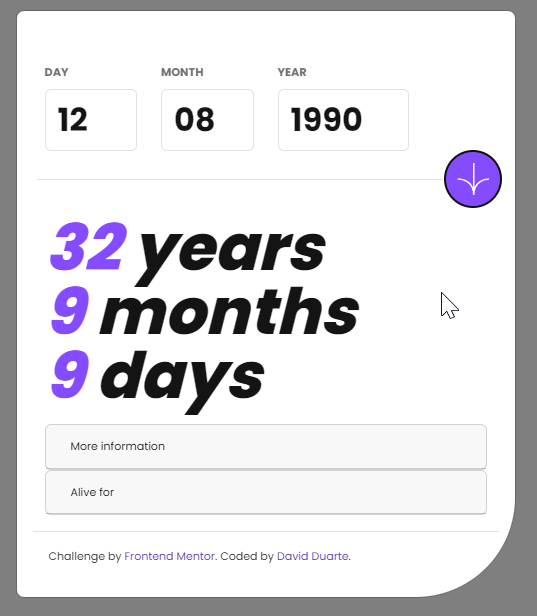

# age-calculator-app-main
Challenged by www.frontendmentor.io -> age-calculator
# Frontend Mentor - Age calculator app solution

This is a solution to the [Age calculator app challenge on Frontend Mentor](https://www.frontendmentor.io/challenges/age-calculator-app-dF9DFFpj-Q). Frontend Mentor challenges help you improve your coding skills by building realistic projects. 

## Table of contents

- [Overview](#overview)
  - [The challenge](#the-challenge)
  - [Screenshot](#screenshot)
  - [Links](#links)
- [My process](#my-process)
  - [Built with](#built-with)
  - [What I learned](#what-i-learned)
- [Author](#author)

## Overview
This challenge is designed to sharpen your JavaScript and form validation skills. Working with dates in JavaScript can be tricky, so this will be a nice test!

### The challenge

Users should be able to:

- View an age in years, months, and days after submitting a valid date through the form
- Receive validation errors if:
  - Any field is empty when the form is submitted
  - The day number is not between 1-31
  - The month number is not between 1-12
  - The year is in the future
  - The date is invalid e.g. 31/04/1991 (there are 30 days in April)
- View the optimal layout for the interface depending on their device's screen size
- See hover and focus states for all interactive elements on the page
- See the age numbers animate to their final number when the form is submitted

### Screenshot

### Links

- Solution URL: ([https://your-solution-url.com](https://github.com/RamRider89/age-calculator-app-main))
- Live Site URL: ([https://your-live-site-url.com](https://davdav.tech/mentor/age-calculator-app-main))

## My process

### Built with

- Semantic HTML5 markup
- CSS custom properties
- Bootstrap
- CSS Grid
- Mobile-first workflow
- [Jquery](www.jquery.com) - JS library
- [Momentjs](https://momentjs.com/) - JS library
- [Bootstrap](getbootstrap.com/)

## Author

- Website - [Carlos David Duarte](https://www.davdav.tech)
- Mail - [Mail](hola@davdav.tech)
- Frontend Mentor - [@RamRider89](https://www.frontendmentor.io/profile/RamRider89)
- Twitter - [@davidgillnn](https://www.twitter.com/davidgillnn)
- GitHub - [@RamRider89](https://github.com/RamRider89/)
